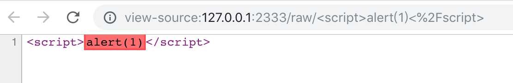

# Chrome XSS Filter Bypass List

Chrome 自带的 XSS Auditor 已经十分强大了，大部分的反射型 XSS 漏洞都会被它拦截，如下图所示：



但是也有少数情况拦截不了的，本项目就是一些 Chrome（到目前最新版 v69.0 为止）拦截不了的 XSS Demo 演示。

## 启动方式

```shell
git clone git@github.com:barretlee/xss-filter-bypass.git
node index.js;
```

- `/points` 目录为反射点
- `bypass.config` 为注入的 XSS 脚本配置列表

## 参考资料

具体细节可以看这篇文章（日文）：[Browser's-XSS-Filter-Bypass-Cheat-Sheet](https://github.com/masatokinugawa/filterbypass/wiki/Browser's-XSS-Filter-Bypass-Cheat-Sheet)